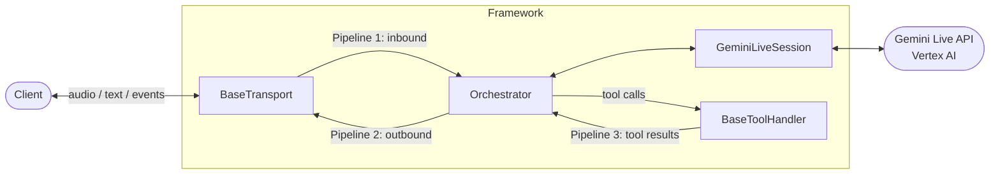

# Gemini Live Framework

Python framework for building **real-time voice AI applications** on Google's [Gemini Live API](https://cloud.google.com/vertex-ai/generative-ai/docs/live-api) via Vertex AI. It handles bidirectional audio streaming, tool execution, transcription, metrics, and recording — so you can focus on your application logic.

## Features

- **Bidirectional audio streaming** — PCM16 and μ-law, with automatic transcoding and resampling between your client and Gemini
- **Orchestrator** — Three concurrent async pipelines: transport → Gemini, Gemini → transport, and tool results → Gemini
- **Pluggable transports** — Ships with `FastapiTransport` (binary/text WebSocket) and `ExotelTransport` (Voicebot Applet); add your own by subclassing `BaseTransport`
- **Tool calling** — Blocking and non-blocking execution via `BaseToolHandler` and `@tool` decorator, with built-in deduplication, cancellation, and queued results
- **Voice activity detection** — User VAD events from Gemini; synthesized model start/stop events via `ModelVoiceActivityDetector`
- **Transcription** — Merged or streaming conversation history with `Transcription`
- **Idle timers** — Multi-trigger async callbacks with pause/resume semantics via `Timer`
- **Session metrics** — Turn counts, interruptions, word counts, and token usage via `MetricTracker`
- **Audio input filtering** — Optional `AudioInputFilter` on any transport for signal processing (denoising, gating, etc.) with automatic exception safety and graceful disabling
- **Call recording** — Wall-clock–aligned mixed mono WAV/MP3 output via `AudioRecorder`
- **Logging** — Colored (TTY) / plain (non-TTY) log formatter with `DISABLED` mode, via `setup_logging()`
- **Telemetry** — Optional [`gemini-live-telemetry`](https://pypi.org/project/gemini-live-telemetry/) integration for automatic metric collection (tokens, latency, turns, tools, audio), local JSON export, and Cloud Monitoring with an auto-created dashboard

## Architecture

The `Orchestrator` runs three cooperating async pipelines:

1. **Transport → Gemini** — Incoming `AudioData` / `TextData` from the client is forwarded to `GeminiLiveSession`.
2. **Gemini → Transport** — Model responses (audio, text, transcripts, voice activity, interruptions, turn completions) are sent back through the transport to the client.
3. **Tool Handler → Gemini** — When a `BaseToolHandler` is registered, tool execution results flow from its queue back to Gemini as function responses or injected context.



## Quick Start

### Prerequisites

- **Python 3.12+** (developed on 3.13)
- A **Google Cloud project** with Vertex AI API enabled
- Credentials with access to the Gemini Live model — either a service account JSON or [Application Default Credentials](https://cloud.google.com/docs/authentication/application-default-credentials)

### Install

```bash
cd gemini-live-framework
python -m venv venv
source venv/bin/activate   # Windows: venv\Scripts\activate
pip install -r requirements.txt
```

### Configure

Create a `.env` file in the project root (see [Configuration](#configuration) for all variables):

```env
GOOGLE_CLOUD_PROJECT=your-gcp-project-id
GOOGLE_APPLICATION_CREDENTIALS=/path/to/service-account.json
```

### Run

```bash
python app.py
```

Or with Uvicorn directly:

```bash
uvicorn app:app --host 0.0.0.0 --port 8000
```

The sample app exposes `GET /`, `GET /health`, and `WS /ws/media-stream`. Wire your `Orchestrator` into the WebSocket route to build a full application.

## Configuration

All settings are loaded from environment variables (and optional `.env`) via [Pydantic Settings](https://docs.pydantic.dev/latest/concepts/pydantic_settings/). Defined in `config.py`.

| Variable | Description | Default |
|----------|-------------|---------|
| `APP_NAME` | Service name returned in API responses | `Gemini Live Framework` |
| `GOOGLE_CLOUD_PROJECT` | GCP project ID for Vertex AI | *(required)* |
| `GOOGLE_CLOUD_LOCATION` | GCP region (reserved for future use) | *(empty)* |
| `GOOGLE_APPLICATION_CREDENTIALS` | Path to service account JSON | *(unset — falls back to ADC)* |
| `DEBUG_MODE` | Enables Uvicorn auto-reload | `false` |
| `LOG_LEVEL` | Python logging level (`DEBUG`, `INFO`, `WARNING`, `ERROR`) | `INFO` |
| `BACKEND_HOST` | Server bind host | `0.0.0.0` |
| `BACKEND_PORT` | Server bind port | `8000` |
| `BACKEND_URL` | Public base URL (used for logging and callbacks) | `http://localhost:8000` |
| `TELEMETRY_MODE` | Telemetry mode: `disabled`, `local` (JSON to `./metrics/`), or `cloud` (Cloud Monitoring + dashboard + JSON) | `disabled` |

`GeminiLiveSession` connects to the `us-central1` region by default. Change the region in `framework/gemini_live_session.py` if needed.

## Core Concepts

### Session & Orchestration

**`GeminiLiveSession`** (`framework/gemini_live_session.py`) manages the Gemini Live API WebSocket — connection lifecycle, sending/receiving audio and text, tool responses, VAD configuration, RAG corpus, and transcription settings. It supports configurable voice, language, and initial text prompts.

**`Orchestrator`** (`framework/orchestrator.py`) wires a transport, session, and optional tool handler into the three concurrent pipelines described in [Architecture](#architecture). It accepts **`OrchestratorCallbacks`** for application-level hooks (`on_event`, `on_turn_complete`, `on_interrupted`, `on_voice_activity`) and an optional `Transcription` instance for conversation history.

### Transports

**`BaseTransport`** (`framework/transports/base_transport.py`) defines the abstract interface for client communication. It auto-creates audio transcoders so the framework always works with **PCM16 16 kHz** inbound and **PCM16 24 kHz** outbound, regardless of your client's wire format. An optional **`AudioInputFilter`** can be attached to any transport to apply signal processing (e.g., denoising) on incoming audio before it reaches the orchestrator.

Two built-in implementations:

- **`FastapiTransport`** — Raw binary frames (audio) and JSON text messages over a FastAPI WebSocket.
- **`ExotelTransport`** — Exotel Voicebot Applet protocol with `media`, `clear`, `mark`, `start`, and `stop` events.

### Tools

**`BaseToolHandler`** (`framework/base_tool_handler.py`) is the base class for tool execution. Define `async def <tool_name>(self, **kwargs)` methods matching your Gemini function declarations. By default, tools are **blocking** (Gemini waits). Use the **`@tool`** decorator for **non-blocking** execution — an interim response unblocks the model while the tool runs in the background, and the final result is injected as context.

Built-in features: deduplication (by tool call ID and content hash), cancellation of in-flight tasks, and a result queue consumed by the Orchestrator.

### Audio

- **`AudioTranscoder`** (`framework/audio_transcoder.py`) — `PcmResampler`, `MulawDecoder`, `MulawEncoder` for format and sample rate conversion.
- **`BufferService`** (`framework/buffer_service.py`) — Accumulates audio into fixed-size chunks before forwarding.
- **`AudioInputFilter`** (`framework/transports/audio_input_filter.py`) — Abstract base for transport-level audio input filters. Subclass and implement `filter(data: bytes) -> Optional[bytes]` for signal processing (denoising, gating, etc.). The base `process()` wrapper provides exception safety and gracefully disables misbehaving filters.
- **`AudioRecorder`** (`framework/audio_recorder.py`) — Records user and model audio into a wall-clock–aligned mixed mono file (WAV or MP3). Both tracks are resampled to 24 kHz, silence-padded for alignment, and mixed down.

### Observability

- **`MetricTracker`** (`framework/metric_tracker.py`) — Session-level counters: audio packets, user/model turns, interruptions, tool calls, word counts, and aggregated Gemini token usage. Call `to_dict()` for a snapshot.
- **`Transcription`** (`framework/transcription.py`) — Maintains a merged or streaming conversation history as `TranscriptEntry` records with timestamps and interruption flags. Accepts an `on_transcript` callback and a `TranscriptMode` (`MERGED` fires the callback once per finalized model turn; `STREAMING` fires on every chunk).
- **`ModelVoiceActivityDetector`** (`framework/model_voice_activity_detector.py`) — Synthesizes model-side voice activity start/stop events from audio chunk timing and expected playback duration.
- **`Timer`** (`framework/timer.py`) — Async timer with sorted trigger points, pause/resume semantics, and configurable max cycles. Used for idle detection and nudge flows.

### Logging & Telemetry

**`setup_logging()`** (`framework/logger.py`) configures the root Python logger with colored output on TTY and plain output in non-TTY environments. Supports `DISABLED` mode to silence all logs. Call once at app startup before other imports.

**`setup_telemetry()`** (`framework/logger.py`) activates [`gemini-live-telemetry`](https://pypi.org/project/gemini-live-telemetry/) based on the `TELEMETRY_MODE` env var:

| Mode | Behavior |
|------|----------|
| `disabled` | No telemetry (default). No import cost. |
| `local` | JSON metrics written to `./metrics/`. No GCP export. |
| `cloud` | Full Cloud Monitoring export, auto-created dashboard, and local JSON. |

The telemetry package instruments the `google-genai` SDK transparently — a single `activate()` call at startup collects metrics for tokens, latency (TTFB), turns, tool calls, audio, and VAD across all Gemini Live sessions.

```python
from framework.logger import setup_logging, setup_telemetry

setup_logging(level="INFO")
setup_telemetry()
```

### Data Models

All shared DTOs live in `framework/models.py`: `AudioData`, `TextData`, `TranscriptData`, `EventData`, `ToolCallData`, `ToolCallCancellationData`, `VoiceActivityData`, `TurnCompleteData`, `UsageMetadataData`, and `TranscriptEntry`.

## Building a Custom Transport

Subclass `BaseTransport` and implement three required methods:

```python
from framework.transports import BaseTransport
from framework.models import AudioData, Data

class MyTransport(BaseTransport):

    async def receive_message(self) -> AsyncIterator[Data]:
        """Yield AudioData, TextData, or EventData from the client."""
        ...

    async def send_audio(self, data: AudioData) -> None:
        """Send audio to the client."""
        ...

    async def send_interruption(self) -> None:
        """Signal an interruption (e.g., flush playback buffer)."""
        ...
```

Set `input_audio_format`, `input_audio_sample_rate`, and `input_audio_chunk_size` (and their `output_` counterparts) to match your client's wire format. The base class creates transcoders automatically.

Optionally override `send_text`, `send_transcript`, `send_voice_activity`, and `send_event` if your protocol supports them.

To apply audio filtering (e.g., denoising), pass an `AudioInputFilter` subclass to the transport:

```python
from framework.transports import AudioInputFilter

class MyFilter(AudioInputFilter):
    async def filter(self, data: bytes) -> bytes:
        return my_denoise(data)

transport = MyTransport(audio_input_filter=MyFilter())
```

## Building a Tool Handler

Subclass `BaseToolHandler` and define async methods whose names match your Gemini `FunctionDeclaration` names:

```python
from framework.base_tool_handler import BaseToolHandler, tool

class MyTools(BaseToolHandler):

    async def get_weather(self, city: str) -> dict:
        """Blocking tool — Gemini waits for the result."""
        return {"temperature": 22, "city": city}

    @tool(blocking=False, execution_delay=2.0, interim_message="Looking that up...")
    async def search_knowledge(self, query: str) -> dict:
        """Non-blocking — Gemini gets an interim response immediately,
        then the final result is injected as context."""
        result = await some_search(query)
        return {"answer": result}

    async def on_complete(self, tool_call, result):
        """Called after any tool finishes. Use for side effects."""
        ...
```

Pass the handler into the orchestrator:

```python
orchestrator = Orchestrator(
    transport=my_transport,
    gemini_session=my_session,
    tool_handler=MyTools(),
)
```

## Acknowledgments

This framework is built upon the best practices, references, and foundational work of **[Krishna (@kkrishnan90)](https://github.com/kkrishnan90)**. We are grateful for the public examples and guidance around Gemini Live that made this project possible.

## License

[MIT License](LICENSE) — Copyright (c) 2026 Pixlware Technologies Pvt. Ltd.
