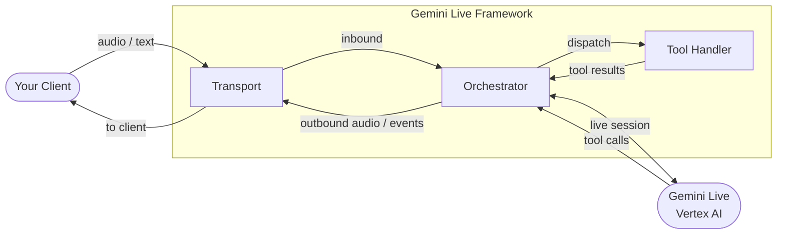

<h1>Gemini Live Framework</h1>

<p>
  <b>The Python framework for building real-time voice agents on Google's Gemini Live API.</b>
</p>

<p>
  
  
  
</p>

Connect your client to Gemini Live (via Vertex AI) in minutes. The framework handles bidirectional audio streaming, transcoding, tool calling, transcription, turn tracking, metrics, and recording — so your code only contains what makes your agent unique.


```mermaid
flowchart LR
    Client([Your Client])

    subgraph gemini_live["Gemini Live Framework"]
        Transport[Transport]
        Orch[Orchestrator]
        Tools[Tool Handler]
    end

    Gemini([Gemini Live<br/>Vertex AI])

    Client -- "audio / text" --> Transport
    Transport -- "inbound" --> Orch
    Orch -- "outbound audio / events" --> Transport
    Transport -- "to client" --> Client
    Orch <-- "live session" --> Gemini
    Tools -- "tool results" --> Orch
    Gemini -- "tool calls" --> Orch
    Orch -- "dispatch" --> Tools
```

The `Orchestrator` runs three concurrent pipelines around a single Gemini Live session: client → Gemini (inbound), Gemini → client (outbound), and Tools → Gemini (function responses and injected context).

## What you can build

- **Web voice agents** over a FastAPI WebSocket (binary audio + JSON events).
- **Phone voice agents** over the Exotel Voicebot Applet protocol.
- **Tool-driven agents** with blocking and non-blocking function calling, deduplication, and cancellation.
- **Anything else** — wire a custom transport by subclassing `BaseTransport`.

## Quickstart

### 1. Install

```bash
cd gemini-live-framework
python -m venv venv && source venv/bin/activate
pip install -r requirements.txt
```

### 2. Configure

```env
# .env
GOOGLE_CLOUD_PROJECT=your-gcp-project-id
```

### 3. Run a voice agent

```python
from fastapi import FastAPI, WebSocket

from gemini_live.logger import setup_logging
from gemini_live.gemini_live_session import GeminiLiveSession
from gemini_live.gemini_live_config_builder import build_gemini_live_config
from gemini_live.transports.fastapi_transport import FastapiTransport
from gemini_live.orchestrator import Orchestrator

setup_logging(level="INFO")

app = FastAPI()


@app.websocket("/ws/media-stream")
async def media_stream(websocket: WebSocket) -> None:
    await websocket.accept()

    config = build_gemini_live_config(
        system_instruction="You are a warm, concise voice assistant.",
        voice_name="Zephyr",
        language_code="en-US",
    )

    transport = FastapiTransport(websocket=websocket)
    session = GeminiLiveSession(config=config, initial_text="Greet the user.")

    orchestrator = Orchestrator(transport=transport, gemini_session=session)
    await orchestrator.start()
```

Send 16 kHz PCM16 mono audio as binary WebSocket frames; receive 24 kHz PCM16 mono audio plus JSON events (`transcript`, `interruption`, `turn_complete`, `voice_activity`, `event`).

## Features

### Connectivity

**Bidirectional audio streaming** — PCM16 and μ-law, with automatic transcoding and resampling between your client and Gemini.

**Pluggable transports** — Ships with `FastapiTransport` (binary audio + JSON events over WebSocket) and `ExotelTransport` (Voicebot Applet protocol). Subclass `BaseTransport` for anything else.

### Conversation control

**Orchestrator** — Runs three concurrent async pipelines around a single Gemini Live session: client → Gemini, Gemini → client, and tool results → Gemini.

**Tool calling** — Blocking and non-blocking execution via `BaseToolHandler` and the `@tool` decorator, with batched multi-tool response delivery, built-in deduplication, cancellation, and queued results.

**Voice activity & turn tracking** — User VAD from Gemini (server-side) or local Silero VAD, synthesized model VAD via `ModelVAD`, and a `TurnTracker` / `ConversationState` state machine that drives user- and model-idle timers.

### Audio pipeline

**Input filtering** — Pluggable `BaseAudioFilter` with exception safety and graceful disabling. Ships with `DeepFilterNetAudioFilter`, an ONNX streaming denoiser (graceful bypass when `dfnstream-py` is missing).

**Call recording** — Optional wall-clock–aligned stereo WAV output via `AudioRecorder` (left = user, right = model). Saves locally or uploads to Google Cloud Storage. Opt-in, buffers in RAM.

### Observability

**Transcription** — Merged or streaming conversation history via `Transcription`, with `on_transcript` callbacks and `TranscriptEntry` records.

**Session metrics** — Turn counts, interruptions, word counts, aggregated Gemini token usage, and per-turn time-to-first-byte (TTFB) via `MetricTracker` (user end-of-speech to first model audio byte).

**Session logging** — `SessionLogger` provides structured logs with bound context (e.g. call ID, Gemini session ID). The `Orchestrator` shares one logger across transport, Gemini session, tools, transcription, recording, metrics, and timers. Optional export to Google Cloud Logging when `CLOUD_LOGGING_ENABLED` is set.

**Application logging & telemetry** — `setup_logging()` configures colored or plain console output (`LOG_LEVEL`, including `DISABLED`). [`gemini-live-telemetry`](https://pypi.org/project/gemini-live-telemetry/) instruments the `google-genai` SDK separately for tokens, latency, turns, tools, and audio — with local JSON export or Cloud Monitoring and an auto-created dashboard.

## Configuration

Only four variables matter to get started (full list below).

| Variable | Description | Default |
|---|---|---|
| `GOOGLE_CLOUD_PROJECT` | GCP project ID for Vertex AI | `""` |
| `GEMINI_LOCATION` | Vertex AI region for the live session | `us-central1` |
| `GEMINI_LIVE_MODEL` | Default Gemini Live model | `gemini-live-2.5-flash-native-audio` |
| `TELEMETRY_MODE` | `disabled`, `local`, or `cloud` | `disabled` |

<details>
<summary><b>All environment variables</b></summary>

| Variable | Description | Default |
|---|---|---|
| `APP_NAME` | Service name returned in API responses | `Gemini Live Framework` |
| `BACKEND_HOST` | Server bind host | `0.0.0.0` |
| `BACKEND_PORT` | Server bind port | `8000` |
| `BACKEND_URL` | Public base URL (used for logging and callbacks) | `http://localhost:8000` |
| `DEBUG_MODE` | Enables Uvicorn auto-reload | `false` |
| `LOG_LEVEL` | `DEBUG`, `INFO`, `WARNING`, `ERROR`, or `DISABLED` | `INFO` |
| `CLOUD_LOGGING_ENABLED` | Export `SessionLogger` payloads to Google Cloud Logging | `false` |
| `DFN_THREAD_LIMIT` | ONNX intra/inter op thread cap for DeepFilterNet (`0` = no limit, library default) | `0` |
| `GOOGLE_CLOUD_PROJECT` | GCP project ID for Vertex AI | `""` |
| `GOOGLE_CLOUD_LOCATION` | GCP region for ADC / credential auto-detection | `""` |
| `GEMINI_LOCATION` | Vertex AI region that `GeminiLiveSession` connects to | `us-central1` |
| `GEMINI_LIVE_MODEL` | Default model when `GeminiLiveSession` is constructed without `model=` | `gemini-live-2.5-flash-native-audio` |
| `GOOGLE_APPLICATION_CREDENTIALS` | Path to service account JSON | *(unset — falls back to ADC)* |
| `GEMINI_API_KEY` | Vertex AI (express-mode) API key. When set, the live session authenticates with the key instead of ADC; `GOOGLE_CLOUD_PROJECT`/`GEMINI_LOCATION` still route to the regional endpoint. Gemini Developer keys are not accepted. | *(unset — uses ADC)* |
| `GCS_BUCKET_NAME` | Default GCS bucket for `AudioRecorder` uploads when `storage_type="cloud"` and no `bucket_name` is passed | `""` |
| `TELEMETRY_MODE` | `disabled`, `local` (JSON to `./metrics/`), `cloud` (Cloud Monitoring + dashboard + JSON) | `disabled` |

</details>

## Guides

<details>
<summary><b>Custom transport</b></summary>

Subclass `BaseTransport` and implement two methods: `receive_message` (parse raw WebSocket frames into framework `Data`) and `send_audio` (send already-transcoded audio bytes to the client). Optionally override any of `send_text`, `send_transcript`, `send_interruption`, `send_voice_activity`, `send_turn_complete`, `send_event` — the base class provides no-op defaults.

The base `BaseTransport.receive()` method already drives the read loop; you do **not** override it. The framework auto-creates audio transcoders so you always see PCM16 16 kHz inbound and can emit whatever format your client expects outbound — `BaseTransport` defaults to PCM16 at 16 kHz inbound and 24 kHz outbound, so you only override `input_audio_*` / `output_audio_*` (`format`, `sample_rate`, `chunk_size`) when your wire format differs.

```python
from typing import AsyncIterator
from starlette.types import Message

from gemini_live.transports.base_transport import BaseTransport
from gemini_live.models import Data, TextData


class MyTransport(BaseTransport):
    async def receive_message(self, message: Message) -> AsyncIterator[Data]:
        if "bytes" in message and message["bytes"]:
            async for audio in self._yield_audio(message["bytes"]):
                yield audio
        elif "text" in message and message["text"]:
            yield TextData(text=message["text"])

    async def send_audio(self, raw: bytes) -> None:
        await self.websocket.send_bytes(raw)
```

The reference implementation is `gemini_live/transports/fastapi_transport.py` — ~50 lines, covers every override.

</details>

<details>
<summary><b>Audio filters & DeepFilterNet</b></summary>

Attach a `BaseAudioFilter` to any transport for signal processing on incoming audio. The base `process()` wrapper handles exceptions and automatically disables a misbehaving filter for the session.

```python
from typing import Optional
from gemini_live.audio_filters.base_audio_filter import BaseAudioFilter


class MyFilter(BaseAudioFilter):
    async def filter(self, data: bytes) -> Optional[bytes]:
        return my_denoise(data)  # return None to drop the chunk

    async def cleanup(self) -> None:
        pass


transport = FastapiTransport(websocket=ws, input_audio_filter=MyFilter())
```

The framework ships with `DeepFilterNetAudioFilter` — an ONNX-based streaming denoiser for 16 kHz PCM16 mono. It internally upsamples to 48 kHz via `soxr`, runs DeepFilterNet frame-by-frame, and downsamples back. Requires the optional `dfnstream-py` dependency; gracefully bypasses audio if missing. Set `DFN_THREAD_LIMIT` to cap ONNX thread usage on CPU-constrained hosts.

```python
from gemini_live.audio_filters.dfn_audio_filter import DeepFilterNetAudioFilter

transport = FastapiTransport(
    websocket=ws,
    input_audio_filter=DeepFilterNetAudioFilter(),
)
```

</details>

<details>
<summary><b>Tool handler & the <code>@tool</code> decorator</b></summary>

Subclass `BaseToolHandler` and define async methods whose names match your Gemini `FunctionDeclaration` names. Every tool method **must** be decorated with `@tool(...)` — the decorator doubles as the dispatch allowlist, so Gemini can't reach undecorated helpers or framework internals.

```python
from google.genai import types
from gemini_live.base_tool_handler import BaseToolHandler, tool


class MyTools(BaseToolHandler):

    @tool()
    async def get_weather(self, city: str) -> dict:
        """Blocking tool — Gemini waits for the result."""
        return {"temperature": 22, "city": city}

    @tool(
        blocking=False,
        scheduling=types.FunctionResponseScheduling.WHEN_IDLE,
    )
    async def search_knowledge(self, query: str) -> dict:
        """Non-blocking (asynchronous) — runs in the background while the
        conversation continues; the result is delivered as a scheduled
        FunctionResponse."""
        return {"answer": await some_search(query)}

    async def on_complete(self, tool_call, result):
        """Called after any tool finishes. Use for side effects."""
        ...


# Non-blocking tool declarations MUST include "behavior": "NON_BLOCKING"
# so the Gemini backend treats the call as asynchronous.
declarations = [
    {
        "name": "get_weather",
        "description": "Get current weather for a city.",
        "parameters": {
            "type": "OBJECT",
            "properties": {
                "city": {"type": "STRING", "description": "City name"},
            },
            "required": ["city"],
        },
    },
    {
        "name": "search_knowledge",
        "description": "Search the knowledge base.",
        "behavior": "NON_BLOCKING",
        "parameters": {
            "type": "OBJECT",
            "properties": {
                "query": {"type": "STRING", "description": "Search query"},
            },
            "required": ["query"],
        },
    },
]

orchestrator = Orchestrator(
    transport=transport,
    gemini_session=session,
    tool_handler=MyTools(),
)
```

**Asynchronous (non-blocking) tools** — With `blocking=False` the tool runs as a background task while the model keeps listening and speaking. The flow follows [Google's asynchronous function calling guide](https://docs.cloud.google.com/gemini-enterprise-agent-platform/models/live-api/asynchronous-function-calling):

1. The tool declaration **must** include `"behavior": "NON_BLOCKING"`. Without it, the Gemini backend treats the call as blocking regardless of the Python-side `@tool(blocking=False)` decorator.
2. With `NON_BLOCKING` behavior, Gemini natively streams verbal acknowledgment (filler speech) while the tool executes — no client-side text injection needed. Guide the model persona via `SystemInstruction` to acknowledge lookups naturally (e.g. *"When invoking long-running tools, give a brief natural verbal acknowledgment."*).
3. On completion, the real result is sent as a `FunctionResponse` with the original call ID and the tool's `scheduling` policy:
   - `WHEN_IDLE` (default) — the model announces the result at the next natural pause, without interrupting the user.
   - `SILENT` — the result is added to context only; the model mentions it when relevant or asked.
   - `INTERRUPT` — the model announces the result immediately, interrupting any ongoing interaction. Reserve for critical alerts.

`scheduling` applies only to non-blocking tools; blocking tools answer within their turn and carry no policy. Note the "SILENT caveat" from the docs: the model may still occasionally narrate a silent tool — add a system-instruction guardrail (e.g. "When using <tool>, perform a SILENT EXECUTION and say nothing") if true silence matters.

**Batched response delivery** — When Gemini emits multiple **blocking** function calls within a single turn, the `Orchestrator` buffers their execution results and delivers all function responses together in a single batched message after `TURN_COMPLETE`. This ensures all calls in a turn are answered simultaneously and prevents Gemini from re-issuing calls it believes were dropped. Non-blocking tools are excluded from the batch — their responses are delivered independently whenever they finish, per their scheduling policy.

</details>

<details>
<summary><b>Transcription, turn tracking & timers</b></summary>

- **`Transcription`** — maintains a `TranscriptEntry` history and fires an `on_transcript` callback. `TranscriptMode.MERGED` fires once per finalized model turn; `STREAMING` fires on every chunk.
- **`TurnTracker` + `ConversationState`** — a state machine (`INITIAL`, `USER_TALKING`, `MODEL_TALKING`, `WAITING_FOR_MODEL`, `WAITING_FOR_USER`) driven by user/model VAD. Invokes `OrchestratorCallbacks.on_turn_state_change(old, new, ttfb)` on every transition; `ttfb` is the seconds from user end-of-speech to first model audio when entering `WAITING_FOR_USER`, otherwise `None`.
- **`Timer`** — async timer with a `name`, sorted trigger points, pause/resume, and max cycles. Used for idle detection and nudge flows; pass a user-idle and/or model-idle `Timer` into the `Orchestrator` and the `TurnTracker` wires them to the conversation state automatically.
- **`Orchestrator.actions`** — `await orchestrator.actions.trigger_bot_timeout()` forces `WAITING_FOR_USER` when a model-idle timer fires without model audio (e.g. custom nudge flows).

```python
from gemini_live.timer import Timer
from gemini_live.orchestrator import Orchestrator, OrchestratorCallbacks

async def on_user_idle(elapsed_seconds: int) -> None:
    ...  # e.g. send "Are you still there?" through Gemini

user_idle = Timer(name="UserIdle", triggers=[10, 20], on_trigger=on_user_idle)

orchestrator = Orchestrator(
    transport=transport,
    gemini_session=session,
    user_idle_timer=user_idle,
    callbacks=OrchestratorCallbacks(on_turn_state_change=log_state),
)

# In a model-idle timer callback (after orchestrator exists):
# await orchestrator.actions.trigger_bot_timeout()
```

</details>

<details>
<summary><b>Call recording</b></summary>

`AudioRecorder` writes a wall-clock–aligned stereo WAV file with user audio on the left channel and model audio on the right, silence-padded for alignment. Both tracks are resampled to 16 kHz and interleaved (vectorized via numpy).

Recording is opt-in: the `Orchestrator` defaults `audio_recorder=None`, and whether to turn it on is an application-level decision (e.g. your own env flag). The recorder buffers the entire call in RAM until `stop()`, so it's intended for dev / QA, not long-running production calls.

```python
from gemini_live.audio_recorder import AudioRecorder

# Local (defaults to ./.recordings/<uuid>.wav)
recorder = AudioRecorder()

# Or upload to Google Cloud Storage on stop()
recorder = AudioRecorder(storage_type="cloud", bucket_name="my-bucket")  # falls back to GCS_BUCKET_NAME

orchestrator = Orchestrator(transport=t, gemini_session=s, audio_recorder=recorder)
```

</details>

<details>
<summary><b>Session logging</b></summary>

Call `setup_logging()` once at process startup (before other framework imports that log). It reads `LOG_LEVEL` and `CLOUD_LOGGING_ENABLED` from the environment.

Pass a `SessionLogger` into the `Orchestrator` to share one logging context across the whole call pipeline. Bind metadata after you know it (call ID, user ID, etc.); the Gemini session binds `gemini_session_id` after connect.

```python
from gemini_live.logger import setup_logging, SessionLogger
from gemini_live.orchestrator import Orchestrator

setup_logging()

logger = SessionLogger()
logger.bind(call_id="exotel-abc123")

orchestrator = Orchestrator(
    transport=transport,
    gemini_session=session,
    logger=logger,
)

# Structured fields are passed as keyword arguments:
logger.info("[MyApp] Call started", agent_id="support-v1")
```

When `CLOUD_LOGGING_ENABLED=true` and GCP credentials are available, `SessionLogger` writes structured payloads to Cloud Logging; otherwise logs go to the console via the standard formatter from `setup_logging()`.

At end of call, `orchestrator.metric_tracker.stop(log_summary=True)` emits a structured session summary (including TTFB aggregates) through the same logger.

</details>

<details>
<summary><b>Gemini Live config</b></summary>

`build_gemini_live_config()` applies battle-tested defaults and forwards any other `LiveConnectConfig` fields via `**kwargs`.

Convenience shortcuts:

| Kwarg | Effect |
|---|---|
| `voice_name`, `language_code` | Builds `speech_config` (do not also pass `speech_config`) |
| `function_declarations` | Appends custom tools alongside optional built-ins |
| `vad_type` | `"gemini"` (server-side automatic activity detection with tuned thresholds) or `"silero"` (local VAD; see below) |
| `enable_google_search` | Adds the built-in Google Search tool |

```python
config = build_gemini_live_config(
    system_instruction="You are a helpful voice assistant.",
    voice_name="Zephyr",
    language_code="en-US",
    function_declarations=my_declarations,
    enable_google_search=True,
)
```

Newer `LiveConnectConfig` capabilities need no builder support — pass them straight through:

```python
from google.genai import types

config = build_gemini_live_config(
    system_instruction="...",
    # Live translation of transcripts (google-genai >= 2.8)
    translation_config=types.TranslationConfig(...),
    # Bias speech recognition toward domain terms (google-genai >= 2.9/2.13)
    input_audio_transcription=types.AudioTranscriptionConfig(
        language_codes=["en-US"],
        custom_vocabulary=[...],
        adaptation_phrases=[...],
    ),
)
```

Related: `USAGE_METADATA` events come from the SDK's `UsageMetadata`, which also carries `service_tier` (google-genai >= 2.9) if you consume the raw SDK object.

</details>

<details>
<summary><b>Voice activity detection (Gemini vs Silero)</b></summary>

The framework supports two VAD strategies, selected with `vad_type`:

- **`"gemini"`** (default) — Gemini's server-side automatic activity detection. Audio streams continuously and the server decides when speech starts and ends.
- **`"silero"`** — Local VAD using [Silero](https://github.com/snakers4/silero-vad) via `sherpa-onnx`. Audio is gated client-side: the bundled `models/silero_vad.onnx` detects speech, forwards only gated audio with manual `activity_start` / `activity_end` signals, and emits `voice_activity` events immediately (no network round-trip) so the orchestrator reacts to speech boundaries without waiting on Gemini.

Pass `vad_type` to both the config builder and the session so they agree:

```python
config = build_gemini_live_config(
    system_instruction="You are a helpful voice assistant.",
    vad_type="silero",
)
session = GeminiLiveSession(config=config, vad_type="silero")
```

To tune the detector, inject a pre-configured `SileroVad` instead of relying on the defaults:

```python
from gemini_live.silero_vad import SileroVad

config = build_gemini_live_config(vad_type="silero")
session = GeminiLiveSession(
    config=config,
    vad_type="silero",
    silero_vad=SileroVad(silence_duration_ms=400, threshold=0.6),
)
```

In `"silero"` mode, `SileroVad`'s `silence_duration_ms` is the per-use-case turn-timing knob (Gemini's server VAD is disabled), mirroring `silence_duration_ms` on the `"gemini"` path. Omitting `silero_vad` keeps the default detector.

`"silero"` mode requires the `sherpa_onnx` dependency (in `requirements.txt`).

</details>

<details>
<summary><b>Telemetry</b></summary>

```python
from gemini_live.logger import setup_logging, setup_telemetry

setup_logging(level="INFO")
setup_telemetry()  # reads TELEMETRY_MODE
```

| `TELEMETRY_MODE` | Behavior |
|---|---|
| `disabled` | No telemetry (default). No import cost. |
| `local` | JSON metrics written to `./metrics/`. No GCP export. |
| `cloud` | Full Cloud Monitoring export, auto-created dashboard, and local JSON. |

The [`gemini-live-telemetry`](https://pypi.org/project/gemini-live-telemetry/) package instruments the `google-genai` SDK transparently — a single `activate()` call (done by `setup_telemetry()`) collects tokens, latency (TTFB), turns, tool calls, audio, and VAD across all sessions.

</details>

## Acknowledgments

This framework is built upon the best practices, references, and foundational work of **[Krishna (@kkrishnan90)](https://github.com/kkrishnan90)**. We are grateful for the public examples and guidance around Gemini Live that made this project possible.

## License

[MIT License](LICENSE) — Copyright (c) 2026 Pixlware Technologies Pvt. Ltd.
